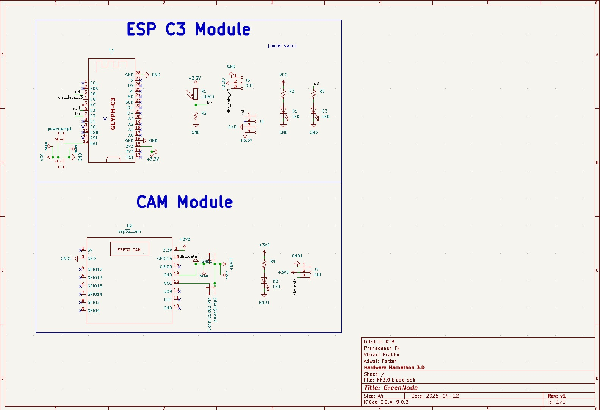
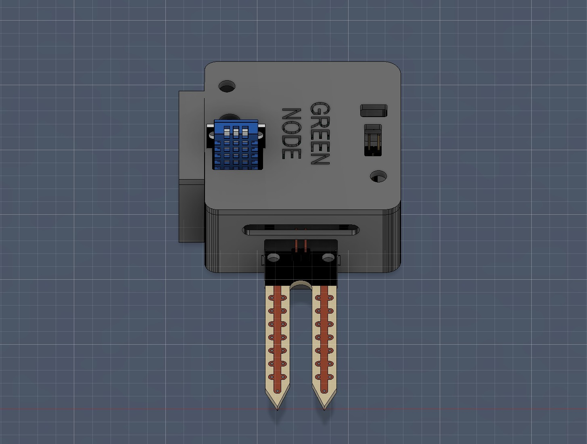

# 1. Title of the project
**Green Node**

# 2. Problem Statement
The global agricultural sector faces a massive adoption gap in precision agriculture. Out of over 500 million small farms globally, only about 10% use digital agricultural services.
- **Prohibitive Costs**: Commercial sensor nodes cost upwards of $200–$250 per unit, with traditional cellular IoT incurring high recurring costs and requiring expensive trenching.
- **Hardware Failures**: Many existing solutions fail in harsh agricultural environments, suffering from battery death during cold snaps or UV degradation.
- **Sensor Inaccuracies**: Low-cost sensors claim to measure nutrients but actually measure soil electrical conductivity, leading to high inaccuracies.
- **Data Fatigue**: Farmers are overwhelmed with raw data rather than actionable insights.
- **Yield vs. Money Disconnect**: Agritech often visualizes agronomy but fails to show economic impact.

# 3. Objective
To build a low-cost, scalable, and open-source plantation monitoring system for the Hardware Hackathon 3.0. Green Node merges robust hardware edge nodes with a sophisticated AI advisory pipeline to bring state-of-the-art agricultural monitoring to farmers. Our core objective focuses on plant survival, optimal yield, and early disease prevention through high-accuracy local ground truth.

# 4. Existing work
The current market is split between expensive agricultural tech and software-heavy platforms lacking local ground truth:
| Competitor | Approach | Weakness |
|---|---|---|
| **Fasal** | Farm-specific IoT | Very high hardware cost, vertical-specific |
| **CropIn** | Software-only platform | No on-ground sensors (estimations only) |
| **Manual Contractors**| Schedule-based inspection | Inefficient, unaccountable |

# 5. Gap analysis
Despite the rise of precision agriculture, competitors fail due to **scaling constraints and disconnected methodologies**. Existing systems lack integration between cheap continuous ambient measurement and deep-learning visual diagnostics. Solutions like Fasal capture field data but demand massive capital ($200+ unit cost), while CropIn relies purely on estimates without true real-world soil/plant mapping. 

Green Node bridges this gap by decoupling continuous soil telemetry from computationally heavy vision tasks—delivering a comprehensive package for under ₹2,400 per node, combined with actionable, real-time AI-guided triaging devoid of monthly LTE service drops.

# 6. Novelty
The core novelty resides in our **Dual-Node Architecture linked to an AI Advisory Pipeline**:
Instead of providing raw datasets like "humidity is 78%", Green Node features a visual capture layer. The camera node feeds leaf images into an AI model combined with live ambient data. The system generates intelligent, multi-lingual daily action priorities—e.g., *"Node 3 has early signs of Late Blight — inspect row 4."*
Additionally, we leverage **Dynamic Sentinal Polling**: Sensor nodes dynamically change their reporting frequency based on internal thresholds (e.g. accelerating ping rates from 30s to 5s during severe moisture drops).

# 7. Your project description
Green Node is a fully integrated ecosystem designed to deliver actionable intelligence. It incorporates:
1. **Hardware Edge Nodes:** Custom-designed PCB routing, deploying ESP32-C3 for continuous environmental tracking (temperature, humidity, moisture, light) and ESP32-CAM nodes for visual plant health assessments.
2. **Comprehensive Data Backend:** Built with FastAPI and an SQLite embedded database to handle data ingestion over local Wi-Fi without internet cellular reliance.
3. **AI Health Advisory Pipeline:** Contextually combined sensor data and visual image scans generate daily Action Plans translated into Tamil, Telugu, Kannada, Hindi, and Bengali using Sarvam AI, complete with audio TTS capabilities.
4. **Earthy Editorial Dashboard:** A fully responsive bespoke dashboard providing clear, animated, high-end insights for the modern facility or farmer.

# 8. List of components and the software used
### Hardware Components
* **MCU:** ESP32-C3 Dev Module (RISC-V) & AI-Thinker ESP32-CAM (ESP32-S).
* **Sensors:** DHT11 / DHT22 (Temperature & Humidity), Capacitive Soil Moisture Sensor v1.2, GL5528 LDR (Ambient Light), OV2640 (2MP Camera).
* **Power:** 5V/3.3V custom regulating PCB headers.

### Software Stack
* **Microcontroller Firmware:** C++ (Arduino Framework), `DHT sensor library`, `ArduinoJson`.
* **Backend Core:** Python (FastAPI, Uvicorn, APScheduler), SQLite.
* **Frontend Design:** Vue.js / VitePress / HTML interfaces.
* **Microservices:** Gemini Vision models natively proxied through a Sarvam AI API pipeline for multilingual translation and audio rendering.

# 9. Methodology
To validate our system in a real-world edge scenario, we deployed it in a live indoor bonsai nursery:
- **Node N-01 (Camera + Env Node):** Captured on-demand 800×600 SVGA SVGA imagery alongside DHT22 inputs whenever the server requested.
- **Node N-02 (Soil Node):** Pushed telemetry continuously every 30 seconds via HTTP POST, adjusting frequency whenever threshold rules were broken.
Data is sent explicitly through local WiFi `mDNS` structures routing directly to a secure, localized central Python Hub—acting as a firewall from public internet threats.

# 10. Work flow
1. **Boot Sequence:** Both nodes power up, synchronize UTC timing via NTP, and POST their IPs to `vikram-Vivobook-Go.local:8000/register`. 
2. **Measurement Cycle (Continuous):** The Soil Node (N-02) wakes, tracks variables, and evaluates internal thresholds to set loop delays (5s vs 30s) before executing an HTTP POST with JSON data.
3. **Capture Cycle (Pull):** The central server queries the Vision Node (N-01) at `GET /capture`. The node streams a JPEG byte packet alongside `X-Moisture` and `X-Temperature` custom headers.
4. **AI Inference & Translation:** The local Hub fuses the image and historical sensor values, passing it to an AI proxy. Sarvam AI retrieves the analysis, translating the diagnostic into local languages.
5. **Dashboard Reflection:** The end-user operates the Vue dashboard reading the localized `Daily Action Plan`.

# 11. Pic of the project/ prototype

# 12. Demo video
*[Insert Link to Live Project Demo Video Here]*

# 13. Create a public github repo and attach the following
*The current repository encompasses the complete documentation, firmware, server environment, and backend code designed explicitly according to the 13-point rubric constraints.*
**Repository URL**: [https://github.com/Vik-Prabhu/Hardware-Hackathon-3.0](https://github.com/Vik-Prabhu/Hardware-Hackathon-3.0)
